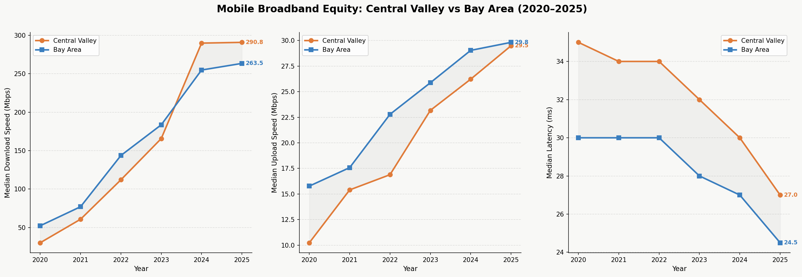
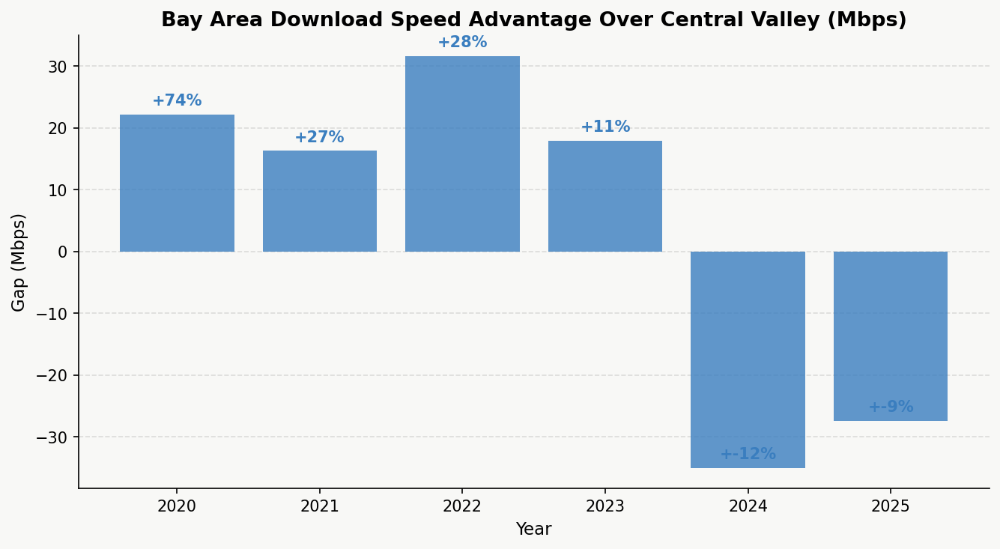
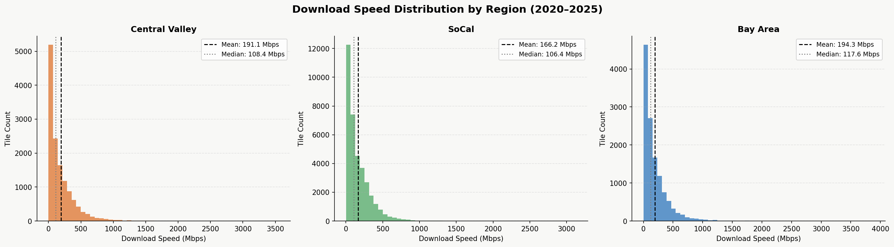
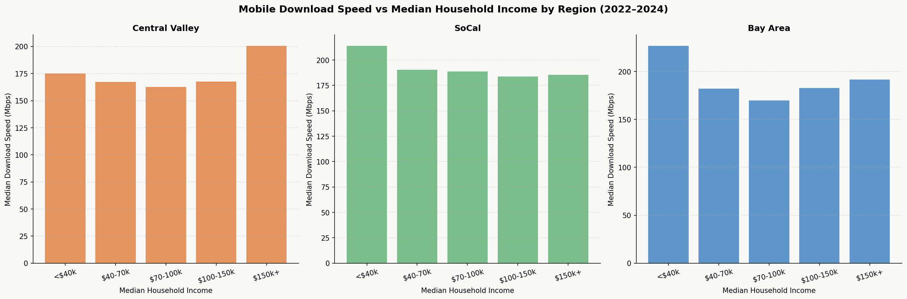
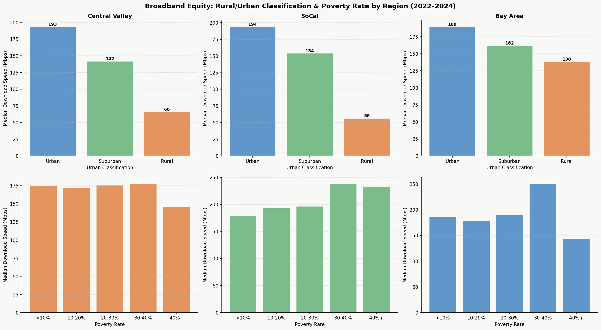

# Ookla Mobile Broadband Equity Analysis
### A CO³ Labs Study | Christian Olivares-Rodriguez
> Analyzing the mobile broadband divide across California using real-world speed data from Ookla Open Data (2020–2025)
 
---
 
## Overview
 
This project investigates mobile broadband performance disparities across three California regions — the **Central Valley**, **Bay Area**, and **Southern California** — using Ookla's open-source speed test dataset. Unlike ISP-reported coverage maps, Ookla data reflects actual speeds measured by real users, making it a more accurate picture of broadband access on the ground.
 
The analysis layers in **U.S. Census demographic data** (median income, poverty rate, urban/rural classification) to understand whether broadband inequity tracks with socioeconomic factors — or something else entirely.
 
---
 
## Tech Stack
 
| Tool | Purpose |
|------|---------|
| Python 3.13 | Core language |
| pandas | Data manipulation |
| geopandas | Spatial joins and geographic analysis |
| folium | Interactive maps |
| matplotlib | Charts and visualizations |
| AWS S3 (Ookla Open Data) | Source data pipeline |
| U.S. Census API | Demographic data |
| Census TIGER/Line Shapefiles | Census tract boundaries |
 
---
 
## How to Run
 
### 1. Clone the repo
```bash
git clone https://github.com/Oli-Data/ookla-broadband-equity.git
cd ookla-broadband-equity
```
 
### 2. Install dependencies
```bash
pip install pandas geopandas folium matplotlib numpy python-dotenv census
```
 
### 3. Set up your Census API key
Get a free API key at https://api.census.gov/data/key_signup.html
 
Create a `.env` file in the project root:
```
CENSUS_API_KEY=your_key_here
```
 
### 4. Run the notebook
Open `ookla_data_project.ipynb` in Jupyter or VS Code.
 
> **Note:** The AWS pipeline cell (pulls raw Ookla data) is set to skip by default since the processed parquet files are large. To re-run the full pipeline, remove the `raise SystemExit` line at the top of that cell.
 
---
 
## Data Sources
 
| Source | Description |
|--------|-------------|
| [Ookla Open Data](https://github.com/teamookla/ookla-open-data) | Mobile performance tiles, 2020–2025, pulled from AWS S3 |
| [U.S. Census ACS 5-Year Estimates (2023)](https://www.census.gov/data/developers/data-sets/acs-5year.html) | Median household income, poverty rate by census tract |
| [Census TIGER/Line Shapefiles (2023)](https://www.census.gov/geographies/mapping-files/time-series/geo/tiger-line-file.html) | Census tract boundaries for spatial join |
 
### Regions Covered
- **Central Valley** — Bakersfield to Redding (35.4°N–40.6°N)
- **Bay Area** — San Jose to Santa Rosa (36.9°N–38.9°N)
- **Southern California** — San Diego to Santa Barbara (32.5°N–34.8°N)
### Methodology Notes
- All analysis filtered to tiles with **≥20 tests** for statistical robustness
- Speed converted from kbps to Mbps throughout
- Median used instead of mean for speed aggregations (more robust to outliers)
- Census demographic overlay scoped to **2022–2024** to minimize temporal mismatch with 2023 ACS vintage
- Urban/Rural classification derived from **census tract land area**, not population density (thresholds: Urban <10 km², Suburban <100 km², Rural ≥100 km²). This is a coarse proxy — a large, sparsely-populated tract and a large tract with a small town in it are classified the same way — and should be read as directional, not a precise density measure
- The 2025 slice of the Ookla dataset has roughly half the tile count of other years (2020–2024 average ~2,700 tiles/region/year vs. ~1,150 in 2025), consistent with 2025 being a partial year at the time of data pull. Trend lines that end in 2025 should be read with that in mind
- The rural/urban and income/poverty bracket comparisons below report **medians only**; per-bracket sample sizes are not printed in the notebook, and the rural bucket in particular is a small share of total tiles (roughly 10% in the Central Valley, and under 2% in the Bay Area and SoCal, based on the full 2020–2025 tile set). No correlation or regression test was run to formally rank predictors — the "stronger predictor" language below is a descriptive read of the medians, not a statistical result
---
 
## Key Findings
 
### 1. The Bay Area–Central Valley Download Gap Narrowed Sharply, But Never Closed
From 2020 to 2025, the median download gap between the Bay Area and Central Valley shrank from **32.8%** (Bay Area ahead) to **0.5%** — effective parity. The gap did not shrink in a straight line: it widened again in 2023 (to 9.1%) before continuing to narrow. At no point in the 2020–2025 window did Central Valley's median download speed exceed the Bay Area's.
 
Latency followed a similar pattern: Central Valley started 2ms behind the Bay Area in 2020, the two converged by 2022, and by 2025 Central Valley was measured as slightly *faster* (23ms vs. 24ms). Latency, like download speed, converged rather than "persisting" as a gap.
 
*(Note: 2025 is a partial-year slice — see Methodology Notes — so the near-zero final-year gap should be treated as provisional rather than a confirmed close.)*
 
### 2. Rural Location Tracks More Consistently With Slower Speeds Than Income Does
Across all three regions, rural tiles had the lowest median download speeds, and the pattern was consistent region to region — unlike the income and poverty comparisons below, which varied in direction by region:
- Central Valley: **65.8 Mbps** rural vs. 193.3 Mbps urban
- SoCal: **56.2 Mbps** rural vs. 193.5 Mbps urban
- Bay Area: **138.1 Mbps** rural vs. 189.4 Mbps urban — even rural Bay Area benefits from proximity to dense infrastructure
Rural tiles are a small fraction of the dataset (see Methodology Notes), so this reads as a consistent directional signal rather than a precisely quantified effect.
 
### 3. Income Shows No Consistent Relationship With Mobile Speed
Lower-income tracts did not consistently have slower speeds, and the pattern differed by region. In the Central Valley and SoCal, the lowest income bracket (<$40k) had *higher* median speeds than the middle brackets; in the Bay Area the same was true, with the <$40k bracket posting the highest median speed of any bracket (226.8 Mbps). One plausible explanation is that low-income tracts in California tend to cluster in dense urban areas with stronger tower coverage — but this notebook doesn't test that explanation directly.
 
Poverty rate showed a similarly inconsistent pattern: Central Valley's highest-poverty tracts (40%+) had the *lowest* median speed of any bracket, while SoCal's highest-poverty tracts had among the *highest*.
 
### 4. The Data Points Toward a Geographic Divide, More Than a Socioeconomic One
Taken together, the rural/urban comparison is the one pattern that holds consistently across all three regions, while the income and poverty comparisons don't move in a consistent direction. That's suggestive of a rural infrastructure gap rather than an affordability gap — but with medians-only reporting, no significance testing, and a rural sample that's a small slice of the data, this should be read as a hypothesis the data is consistent with, not a settled conclusion. Policy interventions focused purely on affordability may miss the communities most underserved by mobile networks, though a more rigorous statistical pass (sample sizes per bracket, a regression controlling for both income and geography together) would strengthen this claim.
 
---
 
## Charts
 
### Year-Over-Year: Download, Upload & Latency

 
### Download Speed Gap: Bay Area vs Central Valley

 
### Download Speed Distribution by Region

 
### Speed vs Median Household Income

 
### Rural/Urban Classification & Poverty Rate

 
> The notebook also generates three interactive Folium maps (fastest/slowest tile markers, a dead-zone heatmap, and a fast-zone heatmap for the Central Valley) that aren't included as static images here. Worth adding if they're meant to be part of the published writeup — see the notebook cells under "Dead Zones."
 
---
*Analysis by Christian Olivares | CO³ Labs LLC*
